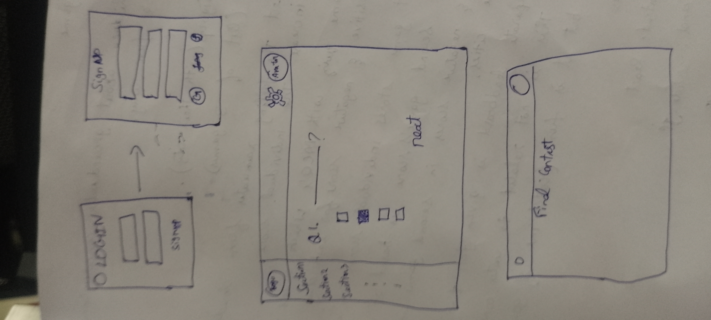

# Children's Water Conservation Program

## Objective
The aim of this project is to educate children about the importance of water conservation through interactive sections and quizzes. By engaging in these activities, children will earn points and enhance their understanding of water conservation practices. Upon completing all sections, participants will take a final exam to assess their knowledge.

## Workflow
1. **Introduction Section:**
   - Brief introduction to water conservation.
   - Simple questions to gauge initial awareness.

1. **Sections:**
    - A total of 10 sections will be available.
    - After completion of previous section, the next one unlocks.

12. **Final Exam:**
    - Comprehensive quiz covering all sections.
    - Points awarded based on correct answers.

## Scoring System
- Points will be awarded for each correct answer.
- Bonus points for completing sections in sequence.
- Final score will determine a certificate of achievement.

## Conclusion
This project aims to inspire children to become active participants in water conservation efforts, making a positive impact on their communities.

## **Wireframe**

